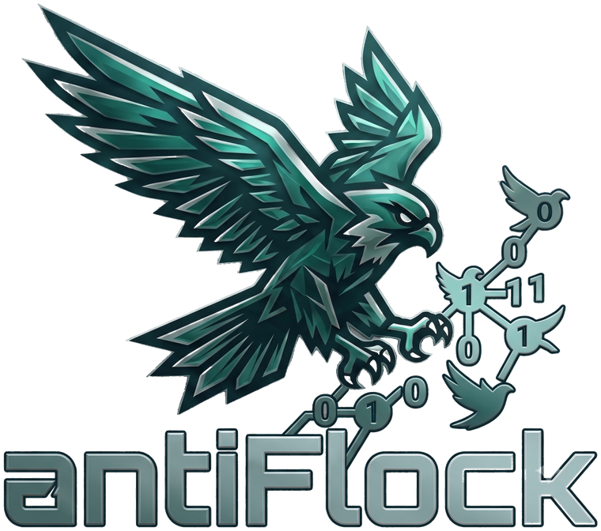
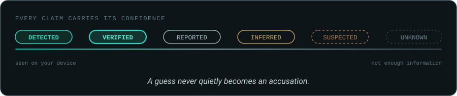
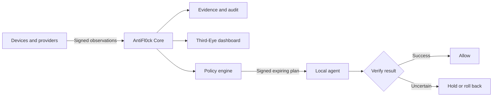

<div align="center">



**Open-source counter-surveillance for the networks you control.**

Map your exposure. Verify your route. Gate sensitive actions.

[](https://github.com/DBarr3/AntiFlock/actions/workflows/ci.yml)
[](LICENSE)
[](docs/release-status.md)
[](go.mod)
[](package.json)

**[Run the demo](#run-the-demo)** · **[Why it exists](#why-antifl0ck-exists)** · **[Architecture](#architecture)** · **[Contribute](#contributing)** · **[Release status](docs/release-status.md)**

<sub>Pre-alpha · The local simulation and dashboard work today. Host-level enforcement remains under active development.</sub>

</div>

---

<div align="center">



</div>

When the trusted path disappears, AntiFl0ck **holds** the action — records why,
verifies the route recovered, and only then lets it through. Every step lands in
a signed local audit log.

**⭐ Star AntiFl0ck** to follow the public build and help more privacy engineers find it.

## Why AntiFl0ck exists

Your phone, laptop, accounts, VPN, Wi-Fi networks, and cloud services leave
related metadata trails that move together — like a **flock**. Each product
shows you one fragment. AntiFl0ck is an open attempt to reveal the whole path,
label what is actually known, and let the operator decide what happens next.

The debate around Flock Safety and large-scale license-plate-reader (ALPR)
networks made one problem impossible to ignore: surveillance infrastructure
grows faster than ordinary people's ability to understand their own exposure.
AntiFl0ck explores what the *defensive* side should look like.

> AntiFl0ck is an independent open-source project. It is not affiliated with or
> endorsed by Flock Safety, and it does not interfere with third-party
> surveillance infrastructure.

## What it does

| | |
| --- | --- |
| **See** | Map your devices, routes, mesh peers, and the metadata others could observe. |
| **Understand** | Label every finding: detected, verified, reported, inferred, suspected, or unknown. |
| **Decide** | Deterministic, operator-defined policy allows, holds, or blocks sensitive actions. |
| **Prove** | Signed decisions, plain-language explanations, expirations, and rollback results — kept on your machine. |

<div align="center">



</div>

## Run the demo

Fully simulated coffee-shop scenario. Needs **Docker** and **Node 24+**; no VPN
account or real data.

```bash
make dev
```

```bash
make lab
```

Then open <http://127.0.0.1:4173> — username `operator`, token from
`.antiflock/dev.env`. On Windows without `make`: `npm run dev` / `npm run lab`.
Full guide: [operator runbook](docs/operator-runbook.md).

## Working today vs. open

The local, simulated slice is complete and sits behind a 10-gate release check
(`make verify`). The real-world pieces are separate, later milestones — they are
not claimed until proven.

**Working today**

- Coffee-shop simulation end-to-end, with five signed audit events
- Signed, hash-chained event and audit log (SQLite)
- Deterministic policy engine, findings, and signed expiring plans
- Secure-action gate + TypeScript SDK
- Endpoint enrollment bootstrap and mTLS device identity
- Linux route/interface observation; opt-in socket-table flow metadata (no packets or payloads)
- Read-only live mesh probes — Tailscale CLI and Headscale BYOK — via the durable agent queue
- Third-Eye dashboard
- Proposal-only Nano watchdog with audited program admission

**Open engineering work**

- Production enforcement and real packet-path integration
- Mobile (Android) enforcement beyond the reference state machine
- Provider lifecycle automation (key rotation, revocation) and broader platform collectors
- Independent security and privacy review

Details and hard boundaries: [release status](docs/release-status.md) ·
[OPEN decisions and release gates](docs/open-questions.md) ·
[Explore open work →](https://github.com/DBarr3/AntiFlock/issues)

## Architecture

Core is the brain — identity, events, policy, explanations — but it never sits
in your traffic path. Each device keeps a local copy of the rules, so
protection keeps working if Core goes offline.



Deep dives: [architecture](docs/architecture.md) ·
[threat model](docs/threat-model.md) ·
[evidence model](docs/evidence-model.md) ·
[enrolled-agent setup](docs/agent-watchdog-loop.md) ·
[Nano watchdog](docs/nano-watchdog.md) · [all docs](docs/README.md)

## Contributing

Help build the defensive layer surveillance technology never gave ordinary
people. Five lanes:

- **Observers** — Linux/macOS/Windows/Android collectors, provider adapters
- **Visualizers** — topology, exposure maps, audit timelines (React)
- **Policy builders** — deterministic rules, secure-action integrations
- **Researchers** — metadata models, ALPR research, threat modeling
- **Hardening engineers** — signing, storage, privilege separation, testing

Start with [CONTRIBUTING.md](CONTRIBUTING.md) and the
[good first issues](https://github.com/DBarr3/AntiFlock/issues?q=is%3Aissue+is%3Aopen+label%3A%22good+first+issue%22).
Security and privacy changes begin with a short design note (ADR); how decisions
get made is in [GOVERNANCE.md](GOVERNANCE.md).

## Safety, security, and license

AntiFl0ck is pre-release defensive software. It does not provide anonymity,
prove that surveillance is occurring, or replace a VPN. An AI may *explain* a
finding, but it never makes the allow-or-block decision. Report
vulnerabilities privately via [SECURITY.md](SECURITY.md), never a public issue.

**License:** [Apache-2.0](LICENSE). The AntiFl0ck name and eagle mark are
project marks — see [TRADEMARKS.md](TRADEMARKS.md). *AntiFl0ck* is the public
name; an earlier working title clashed with another project, so internal
identifiers are still being [migrated](docs/REBRAND.md).

---

<div align="center">

**Evidence over alarm. Operator over platform.**

</div>
